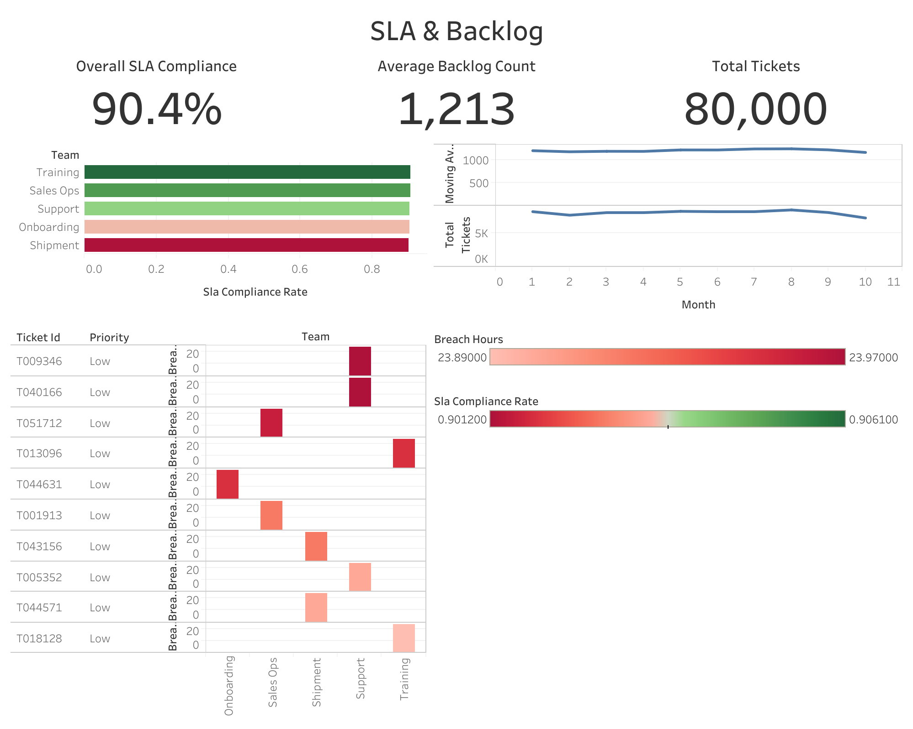

# Operations KPI Automation - SLA & Backlog Analytics

## Executive Summary
Built an end-to-end operational analytics pipeline simulating 80,000 ticket lifecycles to analyze SLA compliance, breach distribution, and backlog performance trends.

## Business Objective
Demonstrate how operational data can be transformed into leadership-ready dashboards for performance management and strategic decision-making.

## Pipeline Overview
1. Synthetic data generation with weighted SLA distribution  
2. KPI computation and breach modeling  
3. Automated export of BI-ready datasets  
4. Tableau dashboard visualization  

## Key Metrics
- 90.4% SLA compliance  
- 1,213 average backlog  
- 80,000 tickets analyzed  
- Top breach drivers identified by team  

## Tech Stack
- Python  
- Pandas  
- Tableau Public  
- Git  

## Dashboard Preview


## Live Dashboard

View the interactive Tableau dashboard here:

[Open SLA & Backlog Dashboard](https://public.tableau.com/views/SLABacklog/Dashboard1)

## How to Run
```bash
python src/generate_data.py
python src/analysis.py

Strategic Context

This project simulates real-world operational reporting workflows used in large-scale e-commerce and enterprise support environments.
